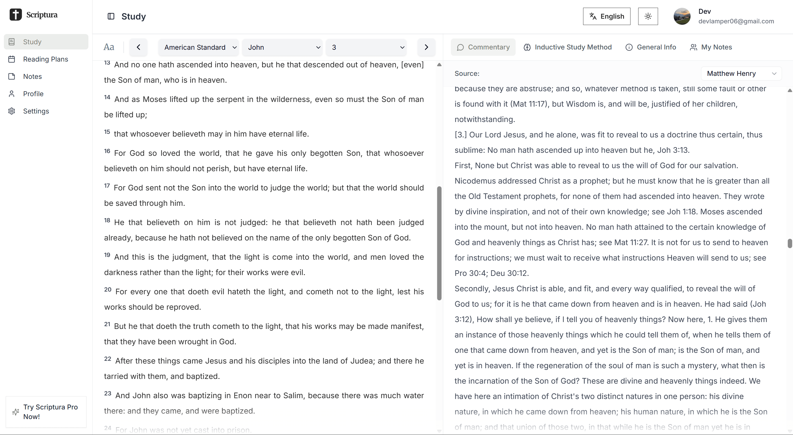

# BijbelStudie - Bijbelstudie Platform

  <!-- Nieuwste releaseversie -->
  <!--    -->
  <!-- Licentie -->
  
  <!-- Open issues -->
  
  <!-- Bijdragers -->
  
  <!-- Instagram volgen -->
  

  
  

## Over BijbelStudie

*BijbelStudie* is een Nederlands bijbelstudie-platform, op het web en als iOS-app. Het lost een simpel probleem op: de Bijbel lezen is makkelijk, hem *begrijpen* niet. Wie een moeilijk hoofdstuk opslaat, heeft meestal geen uitleg bij de hand, geen idee waar te beginnen, en niemand die meeleest.

BijbelStudie zet die hulp naast de tekst. Je leest een hoofdstuk in de vertaling die je gewend bent, met klassiek commentaar ernaast, de grondtekst binnen handbereik en uitleg wanneer je vastloopt. Daarnaast staan er geleide studies klaar die je stap voor stap door een bijbelboek of thema heen nemen, zodat je niet elke dag zelf hoeft te bedenken waar je begint.

Voor beginners én voor mensen die de Bijbel al jaren lezen.

## Inhoudsopgave

- [Functies](#functies)  
- [Technologieën](#technologieën)  
- [Roadmap](#roadmap)  
- [Bijdragen](#bijdragen)  
- [Sponsors](#sponsors)  
- [Licentie](#licentie)  
- [Versie](#versie)  
- [Veelgestelde vragen](#veelgestelde-vragen)  
- [Contact](#contact)

## Functies

-  **Lezen met uitleg ernaast** - Lees een hoofdstuk in je eigen vertaling, met klassieke commentaren, de grondtekst en context binnen handbereik.
-  **Geleide studies** - Stap voor stap door een bijbelboek of thema, in lessen die je in één zitting afmaakt.
-  **Grondtekst** - Zie het oorspronkelijke Hebreeuws en Grieks bij het vers dat je leest, zonder de taal te kennen.
-  **Notities** - Schrijf je gedachten op bij een vers en vind ze later terug.
-  **Voortgang** - Zie welke bijbelboeken je hebt geopend, hoeveel je leest en hoe lang je reeks staat.
-  **Dagvers** - Elke dag een vers om bij stil te staan.
-  **Mobiele app** - Dezelfde studies en voortgang op je telefoon, met een dagelijkse herinnering op het moment dat jij kiest.

## Technologieën

  
  
  
  
  
  
  
  
  
  
  
  
  
  

De website draait op Next.js; de mobiele app is gebouwd met Flutter en praat met dezelfde API.

## Stripe betrouwbaarheid (beheer)

Voor consistente Pro-toegang gebruikt de app drie lagen:

- **Webhook (primair):** `/api/webhooks/stripe`
- **Self-heal bij laden van billing-schermen:** `/api/subscription/status`
- **Periodieke background reconcile:** `/api/internal/reconcile-subscriptions` (via cron)

Benodigde configuratie:

- `STRIPE_WEBHOOK_SECRET` voor Stripe webhook-validatie
- `SUBSCRIPTION_RECONCILE_CRON_SECRET` (of `CRON_SECRET`) voor de interne reconcile-route

Bij Vercel draait de cron via [vercel.json](vercel.json) dagelijks op:

- `/api/internal/reconcile-subscriptions`

## Roadmap

- **v1.0.1** - Donkere en lichte modus geïntegreerd
- **v1.0.2** - Internationalisatie voor Engels, Nederlands en Duits
- **v1.0.3** - BijbelStudie Pro-abonnement toegevoegd
- **v1.0.4** - Commentaren en meer bijbelvertalingen toegevoegd
- **v1.0.5** - Volledig Nederlandstalig; de meertalige versie is teruggedraaid om één taal goed te doen in plaats van drie half
- **v1.0.6** - Grondtekst (Hebreeuws en Grieks) bij het vers dat je leest
- **v1.0.7** - Geleide studies en de iOS-app

## Bijdragen

Bijdragen zijn van harte welkom! Om mee te doen:

1. Fork de repository en maak een nieuwe branch aan.  
2. Voer je wijzigingen door met duidelijke commitberichten.  
3. Dien een pull request in met een beschrijving van je bijdrage.

> *Elke bijdrage helpt BijbelStudie te verbeteren — bedankt!*

## Sponsors

Steun de doorlopende ontwikkeling en word vermeld als projectsponsor:

## Licentie

Dit project is gelicenseerd onder de [GNU General Public License v3.0](LICENSE). Zie de volledige tekst in het **LICENSE**-bestand voor meer informatie.

## Versie

**Huidige versie:** [v1.0.7](https://github.com/AlexLamper/BijbelStudie/releases/tag/v1.0.7)  

## Veelgestelde vragen

Is BijbelStudie gratis te gebruiken?

Ja. Lezen, notities maken en je voortgang bijhouden kost niets. Er is daarnaast BijbelStudie Pro met extra functies: €89,99 per jaar, of €9,99 per maand.

Welke bijbelvertalingen worden ondersteund?

We ondersteunen op dit moment:

**Nederlands**
- Statenvertaling
- NBG-vertaling 1951
- De Heilige Schrift 1917
- Canisiusbijbel 1939

**Engels**
- King James Version (KJV)
- American Standard Version (ASV)
- New English Translation (NET)
- World English Bible (WEB)
- Geneva Bible (1599)
- Coverdale Bible (1535)

Daarnaast staan er klassieke commentaren naast de tekst.

Hoe meld ik een fout of vraag ik een functie aan?

Open een issue op onze [GitHub Issues-pagina](https://github.com/AlexLamper/BijbelStudie/issues) met zo veel mogelijk details.

## Contact

Voor vragen of feedback:  
- Open een [issue op GitHub](https://github.com/AlexLamper/BijbelStudie/issues)  
- E-mail: [info@bijbelstudie.io](mailto:info@bijbelstudie.io)  
- GitHub: [@AlexLamper](https://github.com/AlexLamper)

---

Bedankt voor het verkennen van *BijbelStudie* — we hopen dat het je bijbelstudie-ervaring verrijkt.
